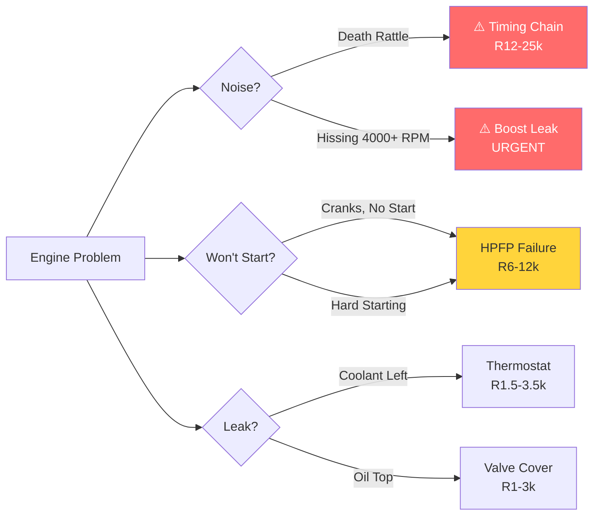

# 2008 Mini Cooper S R56 - N14 Engine Documentation

## Complete Component Guide and Diagnostic System

This comprehensive documentation covers all major systems, components, and diagnostic procedures for the 2008 Mini Cooper S R56 with the N14 1.6L turbocharged engine.

---

## 📋 Quick Start

**New to this car? Start here:**
1. Read [N14 Engine Components](engine/N14-engine-components.md) for engine overview
2. Check [MASTER DIAGNOSTIC FLOWCHART](diagnostics/MASTER-DIAGNOSTIC-FLOWCHART.md) for problem diagnosis
3. Review critical issues below

---

## ⚠️ CRITICAL N14 ENGINE ISSUES

### **Quick Visual Diagnosis:**



**[📊 See Full Interactive Diagrams →](diagnostics/DIAGNOSTIC-FLOWCHART-VISUAL.md)**

---

### **Top 3 Problems You MUST Know:**

1. **⚠️ TIMING CHAIN TENSIONER FAILURE ("Death Rattle")**
   - Can destroy entire engine
   - 2007-2009 models most affected
   - Replace preventatively if not done
   - [Full Diagnosis Guide →](diagnostics/timing-chain-diagnosis.md)

2. **🔧 HIGH PRESSURE FUEL PUMP (HPFP) FAILURE**
   - Very common failure
   - Causes hard starting, loss of power
   - Can fail suddenly
   - [Full Diagnosis Guide →](diagnostics/HPFP-diagnosis.md)

3. **💧 THERMOSTAT HOUSING CRACK**
   - Very common coolant leak
   - Plastic housing cracks from exhaust heat
   - Causes overheating
   - [Full Diagnosis Guide →](diagnostics/overheating.md)

**If you own a 2008 R56 Cooper S, verify the timing chain tensioner has been replaced. If not, budget R12,000-25,000 for this repair ASAP.**

---

## 📂 System Components Documentation

### Engine System
- [N14 Engine Components](engine/N14-engine-components.md) - Complete engine breakdown
  - Timing chain system
  - Valvetrain and Valvetronic
  - Oil system
  - High Pressure Fuel Pump
  - Vacuum pump
  - Sensors

### Turbo System
- [Turbocharger Components](turbo-system/turbo-components.md)
  - Turbocharger specifications
  - Intercooler system
  - Bypass/diverter valve
  - Boost control
  - Intake piping

### Fuel System
- [Fuel System Components](fuel-system/fuel-components.md)
  - Low pressure fuel system
  - High pressure direct injection
  - Fuel pumps (in-tank and HPFP)
  - Fuel injectors
  - EVAP system

### Cooling System
- [Cooling System Components](cooling-system/cooling-components.md)
  - Radiator
  - Electric water pump
  - Thermostat and housing
  - Expansion tank
  - Coolant hoses
  - Cooling fans

### Transmission & Drivetrain
- [Transmission Components](transmission/transmission-components.md)
  - 6-speed manual (Getrag)
  - 6-speed automatic (Aisin)
  - Clutch system
  - Driveshafts and CV joints

### Electrical System
- [Electrical Components](electrical/electrical-components.md)
  - Battery and charging system
  - Engine management (ECU)
  - Ignition system
  - Sensors
  - Lighting
  - Body control

---

## 🔍 Diagnostic Guides

### **Start Here:**
### [🎯 VISUAL DIAGNOSTIC FLOWCHARTS](diagnostics/DIAGNOSTIC-FLOWCHART-VISUAL.md) ⭐ **NEW!**
**Interactive diagrams with visual decision trees** - Click through to diagnose problems visually!

### [📋 MASTER DIAGNOSTIC FLOWCHART](diagnostics/MASTER-DIAGNOSTIC-FLOWCHART.md)
**Text-based diagnostic guide** - Comprehensive problem diagnosis

---

### Quick Symptom Lookup:

| Symptom | Diagnostic Guide |
|---------|-----------------|
| **🚨 Air sound after 4000 RPM + power loss + won't start** | **[Boost Leak No-Start (CRITICAL)](diagnostics/boost-leak-no-start-diagnosis.md)** |
| 🔊 Rattling noise (cold start) | [Timing Chain Diagnosis](diagnostics/timing-chain-diagnosis.md) |
| 🚫 Hard starting / Won't start | [No Start Diagnosis](diagnostics/no-start.md) or [HPFP Diagnosis](diagnostics/HPFP-diagnosis.md) |
| 💨 Loss of boost / power | [Boost Problems](diagnostics/boost-problems.md) or [Turbo Diagnosis](diagnostics/turbo-diagnosis.md) |
| 🌡️ Overheating | [Overheating Diagnosis](diagnostics/overheating.md) |
| 💧 Coolant leak | [Overheating Diagnosis](diagnostics/overheating.md) |

---

## 🛠️ Maintenance Schedule (South Africa - Kilometers)

### **Critical for N14 Reliability:**

#### Every 8,000 km:
- ✅ Engine oil change (0W-40 synthetic)
- ✅ Oil filter replacement
- ✅ **Check oil level weekly between changes**

#### Every 48,000 km:
- ✅ Intake valve carbon cleaning (walnut blasting)
- ✅ PCV valve inspection
- ✅ Air filter replacement

#### Every 96,000 km:
- ✅ Spark plugs replacement
- ✅ Ignition coils inspection
- ✅ Brake fluid flush

#### Preventative Replacements:
- ✅ **Timing chain tensioner** (if 2007-2009 and not done)
- ✅ Vacuum pump (130,000-160,000 km)
- ✅ Thermostat housing (at first sign of leak)
- ✅ Water pump (130,000-160,000 km)
- ✅ Bypass valve (inspect regularly, cheap insurance)

---

## 📊 N14 Engine Specifications

**Engine Code:** N14B16A (Prince Engine)
**Displacement:** 1.6L (1598cc)
**Configuration:** Inline-4, transverse
**Power:** 172 hp @ 5,500 RPM
**Torque:** 177 lb-ft @ 1,600-5,000 RPM
**Compression Ratio:** 10.5:1
**Fuel System:** Direct injection
**Forced Induction:** Twin-scroll turbocharger
**Valve System:** DOHC, 16 valves, Valvetronic

**Performance:**
- 0-100 km/h: 7.3 seconds
- Top Speed: 225 km/h
- Boost Pressure: 1.2-1.3 bar (17-18 PSI)

---

## 📈 Known N14 Issues Summary

### High Priority (Address Immediately):
1. ⚠️ Timing chain tensioner failure → Engine destruction
2. 🔧 High Pressure Fuel Pump failure → No start / loss of power
3. 💧 Vacuum pump failure → Can destroy engine

### Common Issues (Plan for These):
4. 🌡️ Thermostat housing cracks → Coolant leak
5. 💨 Bypass valve failure → Loss of boost
6. 🛢️ Excessive oil consumption → Normal for N14, monitor closely
7. 🔥 Carbon buildup → Regular cleaning required
8. 💧 Rocker cover gasket leak → Oil leaks
9. 💧 Various oil leaks → Common seal failures
10. 🌡️ Water pump failure → Overheating

### Moderate Issues:
11. Turbo seal failure → Blue smoke
12. Cooling fan failure → Overheating
13. Ignition coil failure → Misfires
14. Oxygen sensor failure → Check engine light
15. Clutch/flywheel wear (manual)

---

## 💰 Typical Ownership Costs - South Africa (Beyond Regular Maintenance)

**Budget for these repairs:**

| Repair | Frequency (km) | Cost Range (Rand) |
|--------|-----------|------------|
| Timing chain kit | Once (preventative) | R12,000-25,000 |
| HPFP replacement | 130,000-190,000 km | R6,000-12,000 |
| Carbon cleaning (walnut blasting) | Every 48,000 km | R3,000-6,000 |
| Thermostat housing | 96,000-160,000 km | R1,500-3,500 |
| Bypass valve | 80,000-130,000 km | R1,200-2,500 |
| Water pump | 130,000-190,000 km | R3,500-7,000 |
| Turbo rebuild/replace | 160,000+ km | R8,000-15,000 |
| Vacuum pump | 130,000-190,000 km | R3,000-6,000 |

**Annual maintenance cost (beyond oil changes):** R5,000-15,000
**Major repairs over 5 years:** R30,000-60,000

---

## 🔧 Essential Tools for DIY

### Basic Diagnostics:
- OBD-II code scanner (essential)
- Multimeter
- Flashlight/inspection light
- Basic socket set
- Screwdriver set

### Advanced Diagnostics:
- Borescope (for carbon inspection)
- Compression tester
- Fuel pressure gauge
- Boost pressure gauge
- Smoke machine (leak detection)

### Software (Optional but Helpful):
- INPA (BMW diagnostic software)
- ISTA (BMW service software)
- Carly (OBD phone app)

---

## 📚 Using This Documentation

### For Diagnosis:
1. Note your symptoms
2. Go to [MASTER DIAGNOSTIC FLOWCHART](diagnostics/MASTER-DIAGNOSTIC-FLOWCHART.md)
3. Follow the decision tree to specific guide
4. Use component docs for part numbers and specs

### For Maintenance:
1. Check maintenance schedule above
2. Reference component docs for specifications
3. Follow diagnostic guides for verification

### For Repair Planning:
1. Read diagnostic guide for problem
2. Check component documentation
3. Estimate costs
4. Decide DIY vs professional

---

## 🎯 Quick Reference - Most Common Failures

**Symptoms you'll likely experience:**

1. **Cold start rattle** → Timing chain tensioner
2. **Hard starting** → HPFP failure
3. **Coolant leak left side** → Thermostat housing
4. **Loss of boost** → Bypass valve
5. **High oil consumption** → Normal for N14 (up to 1L per 1,600km)
6. **Check engine light + misfire** → Ignition coils
7. **Blue smoke** → Turbo seals
8. **Overheating** → Water pump or thermostat
9. **Hesitation, poor power** → Carbon buildup
10. **Rattling at clutch** → Dual mass flywheel

---

## ⚙️ N14 vs N18 (Why the N14 Has Issues)

**The N14 (2007-2010) was the first generation Prince engine with many teething problems:**
- Poor timing chain tensioner design
- Vacuum pump on camshaft (dangerous)
- Carbon buildup issues (no port injection)
- High oil consumption

**The N18 (2011-2015) fixed many issues:**
- Improved timing chain system
- Relocated vacuum pump
- Better oil consumption
- Upgraded HPFP

**If shopping for a Cooper S:**
- 2007-2010 = N14 (be prepared for issues)
- 2011-2015 = N18 (more reliable)
- 2014+ = B48 BMW engine (best reliability)

---

## 🔗 External Resources

**Forums:**
- North American Motoring (NAM)
- MiniTorque
- Mini2.com

**Parts:**
- FCP Euro (lifetime warranty)
- ECS Tuning
- MINI Mania
- Pelican Parts

**Software:**
- INPA/ISTA (free BMW diagnostic software)
- Carly (paid OBD app)
- Bimmerlink (iOS/Android)

---

## 📞 When to Seek Professional Help

**DIY Appropriate:**
- Oil changes
- Spark plugs
- Ignition coils
- Air filter
- Bypass valve
- Many sensors

**Professional Recommended:**
- Timing chain replacement
- HPFP replacement (if unsure)
- Turbocharger work
- Carbon cleaning (walnut blasting)
- Transmission work
- Any internal engine work

---

## ✅ Pre-Purchase Inspection Checklist

**If buying a used 2008 R56 Cooper S, verify:**

- [ ] Timing chain tensioner has been replaced (GET PROOF)
- [ ] No cold start rattle present
- [ ] Oil consumption rate acceptable
- [ ] No coolant leaks (especially thermostat housing)
- [ ] Turbo operates smoothly (no smoke, good boost)
- [ ] No check engine lights
- [ ] Service records available
- [ ] Carbon cleaning performed
- [ ] Compression test results good
- [ ] No oil leaks visible

**Red Flags:**
- ❌ No service records
- ❌ Cold start rattle (timing chain)
- ❌ Hard starting (HPFP)
- ❌ Blue smoke (turbo)
- ❌ Coolant in oil or vice versa (head gasket)
- ❌ Multiple check engine codes
- ❌ Owner unaware of N14 issues

---

## 📝 Document Version & Updates

**Version:** 1.0
**Last Updated:** 2025
**Coverage:** 2008 Mini Cooper S R56 with N14 engine

**Document Structure:**
```
mini-cooper-r56/
├── README.md (this file)
├── engine/
│   └── N14-engine-components.md
├── turbo-system/
│   └── turbo-components.md
├── fuel-system/
│   └── fuel-components.md
├── cooling-system/
│   └── cooling-components.md
├── transmission/
│   └── transmission-components.md
├── electrical/
│   └── electrical-components.md
└── diagnostics/
    ├── MASTER-DIAGNOSTIC-FLOWCHART.md (START HERE)
    ├── timing-chain-diagnosis.md
    ├── HPFP-diagnosis.md
    ├── turbo-diagnosis.md
    └── overheating.md
```

---

## 🙏 Disclaimer

This documentation is provided for informational purposes. Always verify information with professional mechanics and official service documentation. The author is not responsible for any damage or injury resulting from use of this information.

**When in doubt, consult a qualified MINI/BMW specialist.**

---

**Happy Motoring! 🏁**

*The N14 engine requires attention and care, but with proper maintenance and awareness of its issues, your R56 Cooper S can provide many kilometers of fun, spirited driving.*
