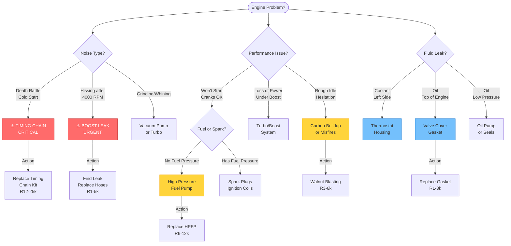
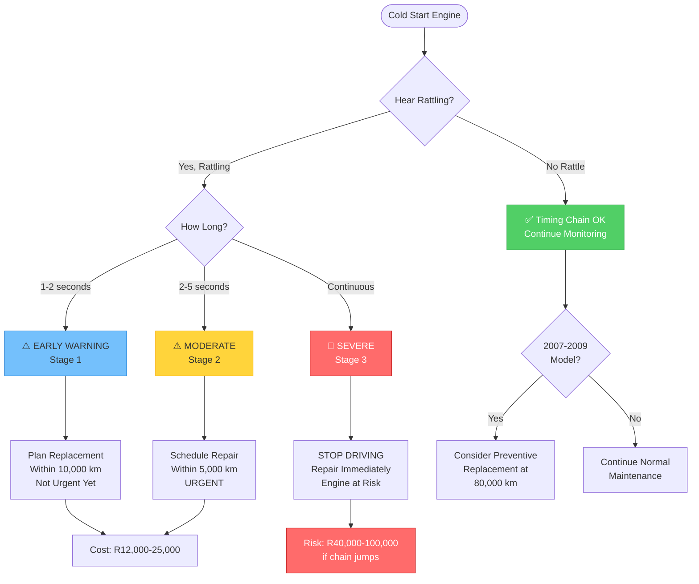
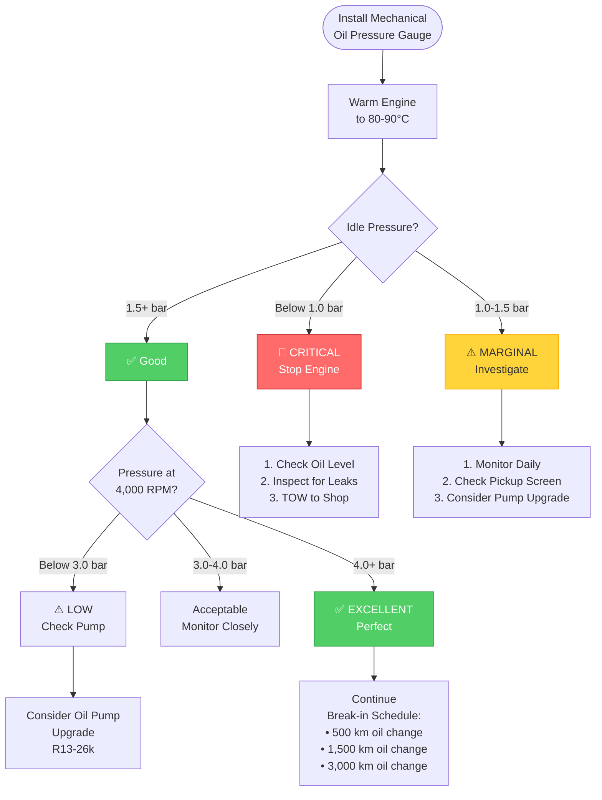
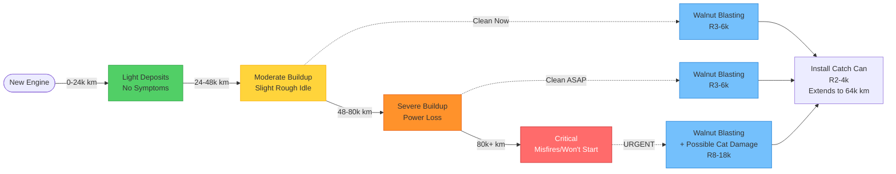
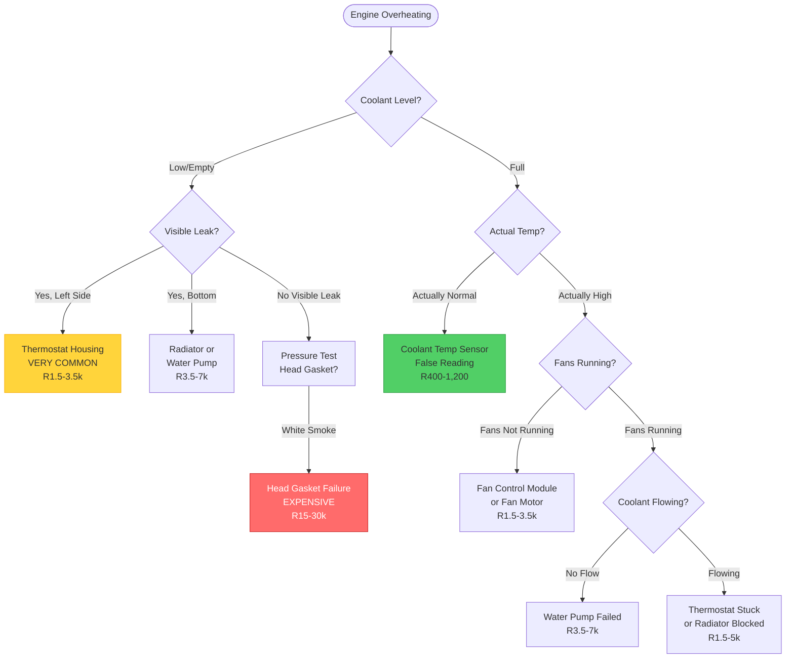
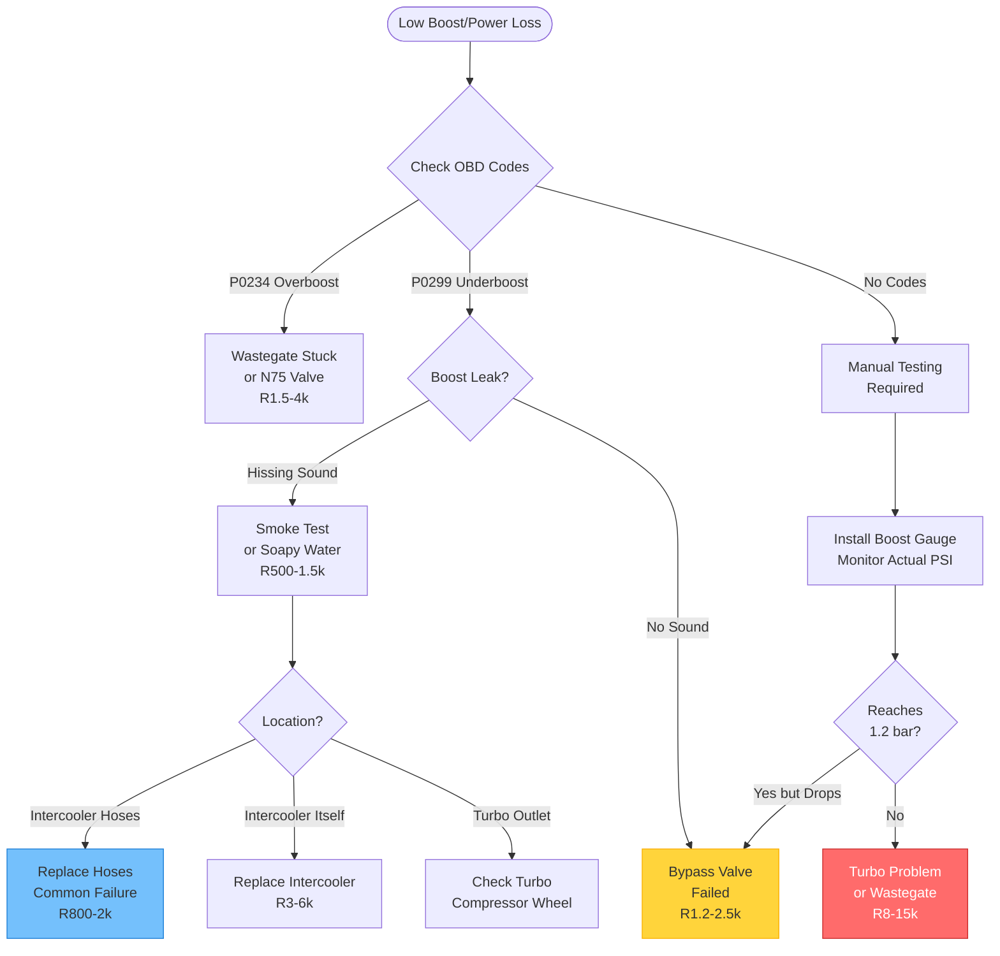
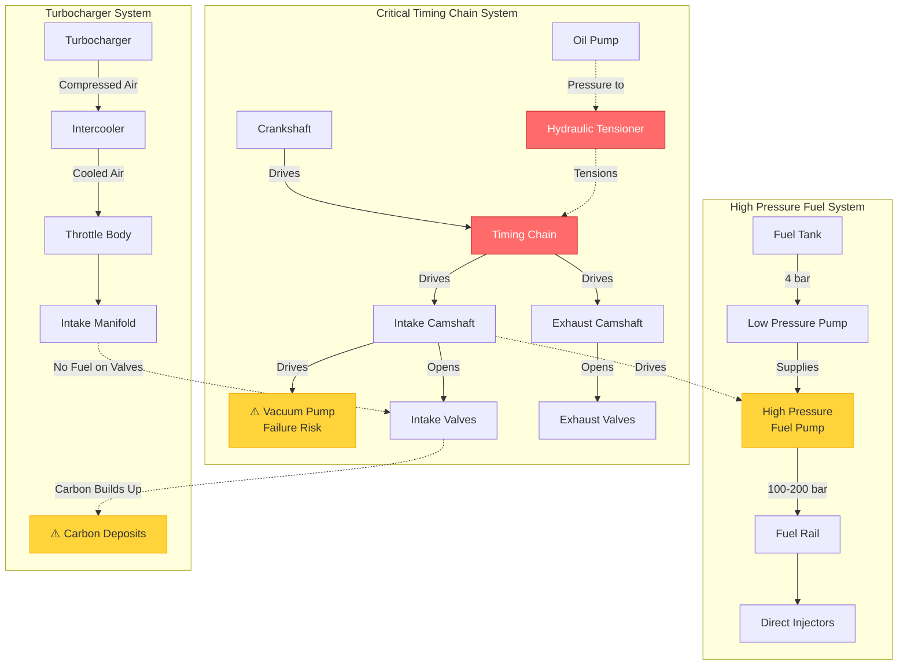

# N14 Visual Diagnostic Flowcharts
## Interactive Diagrams for Quick Problem Diagnosis

---

## 🚨 Critical Symptoms Flowchart

---

## 🔧 Timing Chain Decision Tree

---

## 🔍 Oil Pressure Monitoring (Post-Crankshaft Work)

---

## 📅 Maintenance Timeline

```mermaid
gantt
    title N14 Maintenance Schedule (Kilometers)
    dateFormat X
    axisFormat %s km

    section Critical
    Oil Changes (Every 8k)           :crit, 0, 8000
    Oil Changes (Every 8k)           :crit, 8000, 16000
    Oil Changes (Every 8k)           :crit, 16000, 24000
    Oil Changes (Every 8k)           :crit, 24000, 32000
    Oil Changes (Every 8k)           :crit, 32000, 40000
    Oil Changes (Every 8k)           :crit, 40000, 48000

    section Carbon Cleaning
    First Carbon Cleaning            :active, 48000, 64000
    Second Carbon Cleaning           :96000, 112000

    section Major Service
    Spark Plugs                      :96000, 98000
    Timing Chain (if not done)       :done, 80000, 82000
    Vacuum Pump                      :130000, 132000
    Water Pump                       :130000, 132000

    section Preventive
    Bypass Valve Inspect             :50000, 130000
    PCV System Check                 :48000, 96000
```

---

## 🔄 Carbon Buildup Progression

---

## 🌡️ Overheating Diagnosis Tree

---

## 💨 Boost System Diagnosis

---

## 🔩 Component Relationship Diagram

---

## 🛠️ Post-Major-Repair Checklist

```mermaid
stateDiagram-v2
    [*] --> Install_Gauge: Install Mechanical<br/>Oil Pressure Gauge

    Install_Gauge --> First_500km: First 500 km

    state First_500km {
        [*] --> Monitor_Daily: Check Pressure Daily
        Monitor_Daily --> Check_Level: Check Oil Level<br/>Every 100 km
        Check_Level --> Listen: Listen for Noises
        Listen --> [*]
    }

    First_500km --> Oil_Change_1: Oil Change at 500 km
    Oil_Change_1 --> Next_1000km: 500-1,500 km

    state Next_1000km {
        [*] --> Monitor_Weekly: Check Pressure Weekly
        Monitor_Weekly --> Check_Level_2: Check Oil Level<br/>Every 300 km
        Check_Level_2 --> [*]
    }

    Next_1000km --> Oil_Change_2: Oil Change at 1,500 km
    Oil_Change_2 --> Next_1500km: 1,500-3,000 km

    state Next_1500km {
        [*] --> Stable: Pressure Should<br/>Be Stable Now
        Stable --> [*]
    }

    Next_1500km --> Oil_Change_3: Oil Change at 3,000 km
    Oil_Change_3 --> Normal: Normal Service<br/>Every 8,000 km
    Normal --> [*]
```

---

## 💡 How to Use These Diagrams

1. **Navigate by symptom** - Start with the relevant flowchart
2. **Follow the decision tree** - Answer questions to narrow down the problem
3. **Check costs** - Repair costs shown in South African Rand
4. **Refer to detailed guides** - Links provided throughout documentation

**All diagrams are interactive on GitHub and mobile-friendly!**

---

## 📱 Mobile Viewing

These Mermaid diagrams render perfectly on:
- ✅ GitHub website (desktop and mobile)
- ✅ GitHub mobile app
- ✅ GitHub Pages
- ✅ Any modern browser

**Tip:** On mobile, diagrams can be zoomed and panned for easy viewing.
