# N14 Engine System Diagrams
## Visual Component Relationships and Data Flow

---

## 🔧 Complete Engine System Overview

```mermaid
graph TB
    subgraph Air_Intake[Air Intake System]
        Air[Fresh Air] -->|Filtered| Turbo_In[Turbo Inlet]
        Turbo_In --> Compressor[Turbo Compressor]
        Compressor -->|Pressurized<br/>1.2 bar| Intercooler[Intercooler]
        Intercooler -->|Cooled Air| Throttle[Throttle Body]
        Throttle --> Intake_Mani[Intake Manifold]
    end

    subgraph Combustion[Combustion Chamber]
        Intake_Mani --> Intake_Valves[Intake Valves<br/>⚠️ Carbon Prone]
        Injectors[Direct Injectors] -.->|High Pressure<br/>Fuel Spray| Combustion_Chamber[Combustion<br/>Chamber]
        Intake_Valves --> Combustion_Chamber
        Spark[Spark Plugs] -.->|Ignition| Combustion_Chamber
        Combustion_Chamber --> Exhaust_Valves[Exhaust Valves]
    end

    subgraph Exhaust_System[Exhaust System]
        Exhaust_Valves --> Exhaust_Mani[Exhaust Manifold]
        Exhaust_Mani -->|Hot Gases| Turbine[Turbo Turbine]
        Turbine -->|Spins| Compressor
        Turbine --> Cat[Catalytic<br/>Converter]
    end

    subgraph Fuel_High_Pressure[Fuel System - High Pressure]
        Fuel_Tank[Fuel Tank] -->|4 bar| LP_Pump[Low Pressure<br/>Pump]
        LP_Pump --> HPFP[⚠️ High Pressure<br/>Fuel Pump<br/>Common Failure]
        Camshaft_Intake -.->|Mechanical<br/>Drive| HPFP
        HPFP -->|100-200 bar| Fuel_Rail[Fuel Rail]
        Fuel_Rail --> Injectors
    end

    subgraph Timing_System[Timing Chain System - CRITICAL]
        Crankshaft[Crankshaft] -->|Drives| Timing_Chain[⚠️ Timing Chain<br/>Death Rattle Risk]
        Timing_Chain --> Camshaft_Intake[Intake Camshaft]
        Timing_Chain --> Camshaft_Exhaust[Exhaust Camshaft]
        Tensioner[⚠️ Hydraulic<br/>Tensioner<br/>Design Flaw] -.->|Maintains<br/>Tension| Timing_Chain

        Camshaft_Intake -->|Opens/Closes| Intake_Valves
        Camshaft_Exhaust -->|Opens/Closes| Exhaust_Valves

        Camshaft_Intake -.->|Drives| Vacuum_Pump[⚠️ Vacuum Pump<br/>Can Fail & Destroy Engine]
    end

    subgraph Lubrication[Oil System]
        Oil_Pan[Oil Pan] --> Oil_Pump[Oil Pump]
        Crankshaft -.->|Drives| Oil_Pump
        Oil_Pump -->|Pressure| Oil_Filter[Oil Filter]
        Oil_Filter -->|Clean Oil| Main_Gallery[Main Oil<br/>Gallery]
        Main_Gallery --> Bearings[Crankshaft<br/>Bearings]
        Main_Gallery --> Tensioner
        Main_Gallery --> Camshaft_Bearings[Camshaft<br/>Bearings]
        Main_Gallery --> Turbo_Oil[Turbo Oil<br/>Feed]
        Turbo_Oil -.-> Compressor
    end

    subgraph Valvetronic[Valvetronic System - Variable Valve Lift]
        Valvetronic_Motor[Valvetronic<br/>Motor] -.->|Electric| Eccentric_Shaft[Eccentric Shaft]
        Eccentric_Shaft -.->|Variable<br/>Lift| Intake_Valves
    end

    subgraph PCV_System[PCV System]
        Combustion_Chamber -.->|Blow-by<br/>Gases| Crankcase[Crankcase]
        Crankcase -->|Oil Vapor| PCV[PCV Valve<br/>in Valve Cover]
        PCV -->|To Intake| Intake_Mani
        PCV -.->|⚠️ Causes| Intake_Valves
    end

    style Timing_Chain fill:#ff6b6b,stroke:#c92a2a,color:#fff
    style Tensioner fill:#ff6b6b,stroke:#c92a2a,color:#fff
    style Vacuum_Pump fill:#ff6b6b,stroke:#c92a2a,color:#fff
    style HPFP fill:#ffd43b,stroke:#fab005
    style Intake_Valves fill:#ffd43b,stroke:#fab005
    style PCV fill:#ffd43b,stroke:#fab005
```



---

## 🔄 Timing Chain System (Critical Detail)

```mermaid
graph TD
    subgraph Crankshaft_Drive[Crankshaft Power]
        Combustion[Combustion<br/>Force] --> Pistons[4 Pistons]
        Pistons --> Crank[Crankshaft<br/>Rotation]
    end

    subgraph Chain_System[Timing Chain Drive System]
        Crank --> Crank_Sprocket[Crankshaft<br/>Sprocket]
        Crank_Sprocket --> Chain[Timing Chain<br/>⚠️ STRETCHES OVER TIME]

        Oil_System[Oil Pump] -->|Oil Pressure| Hydraulic_Tensioner[Hydraulic Tensioner<br/>⚠️ DESIGN FLAW<br/>Cannot Maintain Pressure]
        Hydraulic_Tensioner -.->|Pushes on| Tensioner_Arm[Tensioner Arm]
        Tensioner_Arm -.->|Tensions| Chain

        Chain --> Guide_Upper[Upper Guide Rail<br/>Plastic - Can Break]
        Chain --> Guide_Lower[Lower Guide Rail<br/>Plastic - Wears]

        Chain --> Intake_Cam_Sprocket[Intake Cam<br/>Sprocket]
        Chain --> Exhaust_Cam_Sprocket[Exhaust Cam<br/>Sprocket]
    end

    subgraph Failure_Chain[Failure Cascade]
        Tensioner_Fails[1. Tensioner Loses<br/>Pressure] --> Chain_Loose[2. Chain Becomes<br/>Loose]
        Chain_Loose --> Rattle[3. Death Rattle<br/>Sound]
        Rattle --> Guides_Damage[4. Guides Break<br/>from Slapping]
        Guides_Damage --> Chain_Stretch[5. Chain Stretches<br/>Further]
        Chain_Stretch --> Timing_Off[6. Valve Timing<br/>Incorrect]
        Timing_Off --> Jump[7. Chain Jumps<br/>Teeth]
        Jump --> Catastrophic[8. Valves Hit Pistons<br/>⚠️ ENGINE DESTROYED<br/>R40-100k]
    end

    subgraph Prevention[Prevention Strategy]
        Monitor[Listen for<br/>Rattle Daily] --> Early_Detection[Detect at<br/>Stage 3]
        Early_Detection --> Replace[Replace Chain Kit<br/>R12-25k]
        Replace --> New_Tensioner[Updated Tensioner<br/>Design]
        New_Tensioner --> Safe[Safe for<br/>80-120k km]
    end

    Intake_Cam_Sprocket --> Intake_Cam[Intake Camshaft]
    Exhaust_Cam_Sprocket --> Exhaust_Cam[Exhaust Camshaft]

    Intake_Cam --> Vacuum_Drive[⚠️ Drives Vacuum Pump<br/>Another Failure Point]
    Intake_Cam --> HPFP_Drive[Drives HPFP]

    style Chain fill:#ff6b6b,stroke:#c92a2a,color:#fff
    style Hydraulic_Tensioner fill:#ff6b6b,stroke:#c92a2a,color:#fff
    style Catastrophic fill:#ff6b6b,stroke:#c92a2a,color:#fff
    style Rattle fill:#ffd43b,stroke:#fab005
    style Replace fill:#51cf66,stroke:#2f9e44,color:#fff
```



---

## 💨 Boost System Data Flow


---

## 🛢️ Oil System Flow & Pressure Points

```mermaid
flowchart TD
    Start[Oil Pan<br/>~5 Liters] --> Pickup[Pickup Screen<br/>⚠️ Can Clog]
    Pickup --> Pump[Oil Pump<br/>Driven by Crankshaft]

    Pump --> Pressure_Check{Pressure<br/>Check}

    Pressure_Check -->|Normal| Filter[Oil Filter]
    Pressure_Check -->|⚠️ Low| Issue1[Check:<br/>• Worn pump gears<br/>• Clogged pickup<br/>• Oil level low]

    Filter --> Main_Gallery[Main Oil Gallery<br/>Distribution Point]

    Main_Gallery --> Priority1[PRIORITY 1:<br/>Crankshaft Bearings<br/>CRITICAL]
    Main_Gallery --> Priority2[PRIORITY 2:<br/>Camshaft Bearings<br/>CRITICAL]
    Main_Gallery --> Priority3[PRIORITY 3:<br/>Timing Chain Tensioner<br/>⚠️ Needs Pressure]

    Main_Gallery --> Secondary1[Piston Cooling Jets]
    Main_Gallery --> Secondary2[Valvetronic System]
    Main_Gallery --> Secondary3[Turbo Oil Feed]

    Priority1 --> Spec1[Idle: 1.5+ bar<br/>4000 RPM: 4.0+ bar]
    Priority2 --> Spec2[Same as Crank]
    Priority3 --> Spec3[⚠️ If Low Pressure:<br/>Chain Goes Loose]

    Secondary3 --> Turbo_Bearing[Turbo Bearings]
    Turbo_Bearing --> Drain[Turbo Oil Drain]
    Drain --> Start

    Priority1 --> Return[Oil Returns<br/>to Pan]
    Priority2 --> Return
    Secondary1 --> Return
    Secondary2 --> Return

    subgraph Post_Crankshaft_Work[After Crankshaft Re-Engineering]
        Tighter[Tighter Bearing<br/>Clearances] -.->|Requires| Higher[Higher Oil Pressure<br/>1.5 bar minimum idle]
        Stock_Pump{Stock Pump<br/>Adequate?}
        Stock_Pump -->|Maybe| Monitor[Monitor with<br/>Mechanical Gauge]
        Stock_Pump -->|No| Upgrade[Upgrade to<br/>High-Flow Pump<br/>R4-8k]
    end

    style Pickup fill:#ffd43b,stroke:#fab005
    style Priority3 fill:#ff6b6b,stroke:#c92a2a,color:#fff
    style Spec3 fill:#ff6b6b,stroke:#c92a2a,color:#fff
    style Upgrade fill:#74c0fc,stroke:#1c7ed6
```



---

## ⚡ Ignition & Fuel Injection Timing


---

## 🌡️ Cooling System Circuit


---

## 🔋 Electrical System Architecture


---

## 📊 Pressure & Temperature Normal Ranges

```mermaid
graph TB
    subgraph Oil_Pressure[Oil Pressure (bar)]
        OP_Idle[Idle Hot:<br/>1.5-2.5 bar]
        OP_2000[2000 RPM:<br/>2.0-3.0 bar]
        OP_4000[4000 RPM:<br/>4.0-5.0 bar]
        OP_Red[⚠️ Below 1.0 bar:<br/>CRITICAL]
    end

    subgraph Boost_Pressure[Boost Pressure]
        BP_Idle[Idle/Cruise:<br/>0 bar atmospheric]
        BP_Part[Part Throttle:<br/>0.4-0.8 bar]
        BP_Full[Full Throttle:<br/>1.2-1.3 bar]
        BP_Over[⚠️ Above 1.4 bar:<br/>Overboost]
    end

    subgraph Coolant_Temp[Coolant Temperature]
        CT_Cold[Cold Start:<br/>20°C ambient]
        CT_Warm[Warming Up:<br/>60-80°C]
        CT_Normal[Normal Operating:<br/>88-95°C]
        CT_Hot[⚠️ Above 105°C:<br/>Overheating]
    end

    subgraph Fuel_Pressure[Fuel System Pressure]
        FP_Low[Low Pressure:<br/>4 bar tank]
        FP_Idle[HPFP Idle:<br/>80-100 bar]
        FP_Load[Under Load:<br/>120-150 bar]
        FP_Max[Maximum:<br/>150-200 bar]
    end

    style OP_Red fill:#ff6b6b,stroke:#c92a2a,color:#fff
    style BP_Over fill:#ff6b6b,stroke:#c92a2a,color:#fff
    style CT_Hot fill:#ff6b6b,stroke:#c92a2a,color:#fff
```

---

## 💡 How These Diagrams Help

1. **Understand System Relationships** - See how components interact
2. **Identify Failure Cascades** - One failure can cause others
3. **Prioritize Repairs** - Visual indication of critical vs common issues
4. **Troubleshoot Systematically** - Follow the flow to find root causes
5. **Plan Preventive Maintenance** - See what to monitor

**All diagrams render on GitHub desktop, mobile, and GitHub Pages!**
